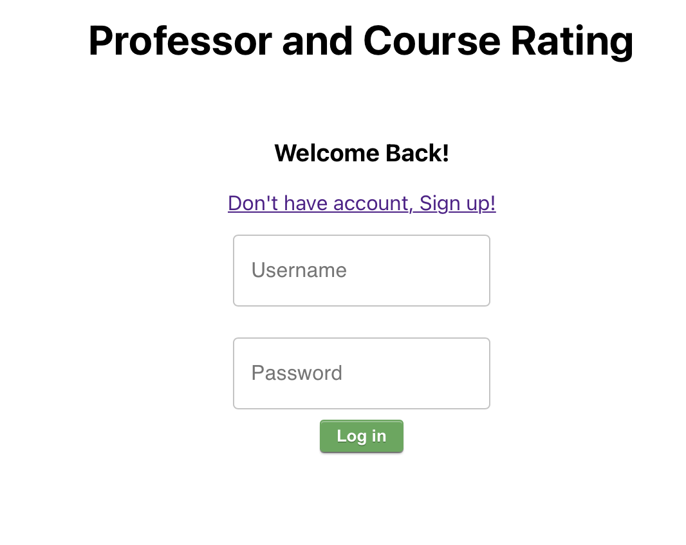
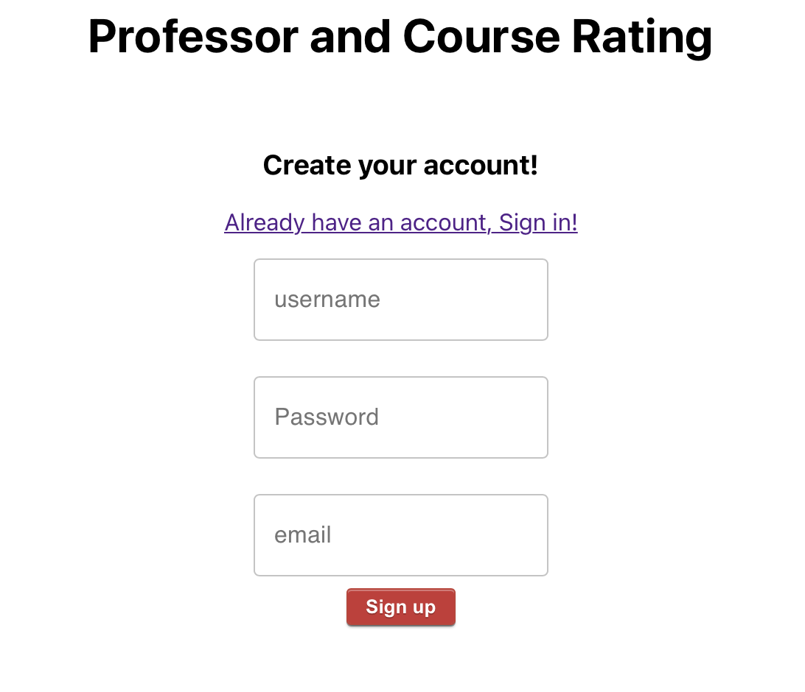
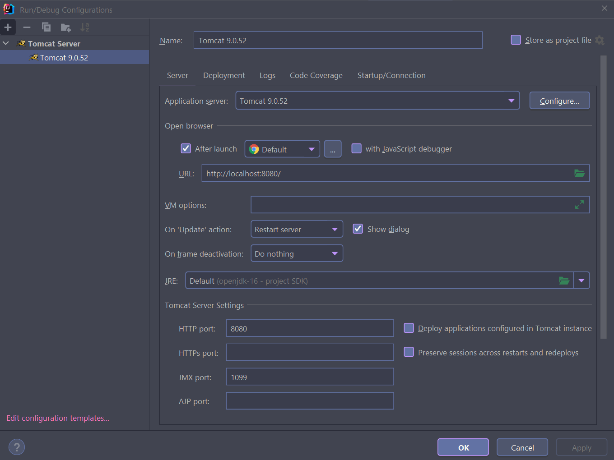
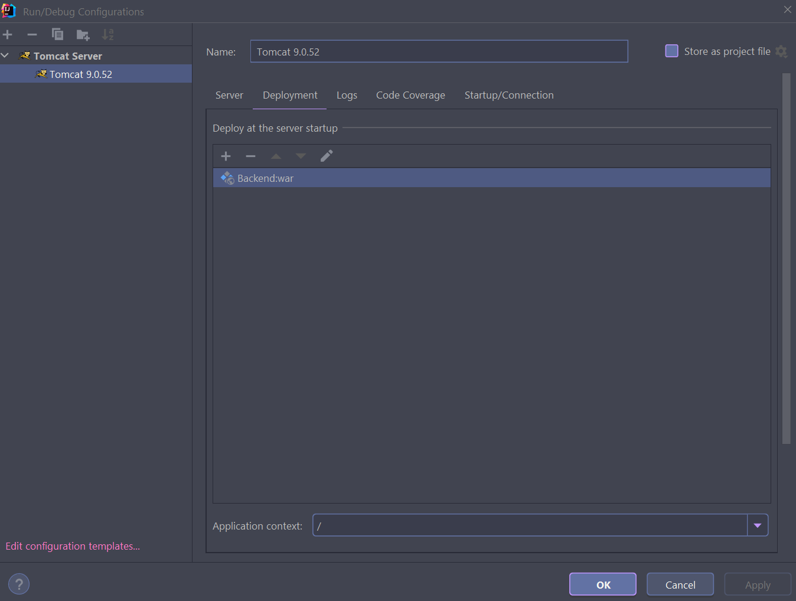
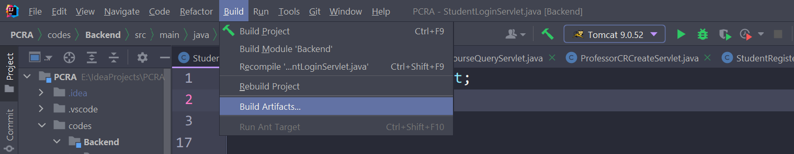
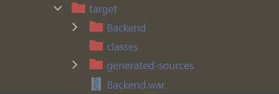

# Development Report of Professor&Course Rating Application

## 1. Project Scenario

At the beginning of every semester, NTU students need to register courses that they want to take. Usually, the deadline of the course registration is the end of week 2. To decide whether to take a course, students can read the course’s syllabus, and experience the classes in the first two weeks. However, these may be not enough for students to make a good decision. To know about the professor and his/her course more clearly, additional information from those who have taken the course will be helpful.

The Professor & Course Rating System (PCRA) provide a platform where students can publish their comments and rates on a specific professor and his/her course anonymously. Students can also search the professor or the course by name to browse the comments and rates on the professor or the course. All comments and rates are shown anonymously but students can still change or delete their previous comments and rates.

The main users of PCRA are Students and Application Administrator (AA).

Features Completed:
Users could register the account through inputting username, password and email address. And they can use existed username and password to sign in.

In addition, users could create course entry through inputting course ID, course name and name of the professor whose entry has been created in the database.
From dashboard page, users could enter the professors and courses list webpage. All professors entries and courses entries are listed in separate pages. Users could click each entry to enter that professor or course specific C&R list page.
In the specific prof or course page, users could read all comments and score on that prof or course.
In some of the webpages, there exist NavBar where users could create their own comments and score for that prof or course, go back to dashboard page and log out.
Finally, we restrict the users' accessible webpages. Before login, users only access login, register pages and can't access the other pages via URL. After login, users could access the content pages and can't access login and register via URL.

## 2. Architecture Design

### 2.1 Entire Architecture

### 2.2 Frontend (React, JavaScript, CSS)
We choose React as the frontend's framework since it is flexible to achieve the designed UI pattern. In addition, we choose BrowseRouter to setup the website's route and fetch as the tool to send HTTP requests and receive the responses information. Every webpage we use modular design and each page has its own files directory which is clear and easily distinguished.

### 2.3 Backend (Servlet)
To clearly introduce the servlets that we create, we classify these servlets into four groups.

1. Student

   As for student users, the route registration includes student registration and login. Thus, we write two servlets for them respectively. Both `StudentRegisterServlet` and `StudentLoginServlet` are implemented by overwritten the `doPost` method derived from the class `HttpServlet`.

   In `StudentRegisterServlet`, we acquire the username and the password of a new user, and then allocate a token for she/he to attain the authentication to use the functions in the login mode. Before we write the username and the password into the database, the password is encrypted by the MD5 algorithm with a salt value generated from a random UUID, which protects the security of the secret information. After successfully registering a user, `StudentRegisterServlet` sends the response to the client, whose content includes a json `{"info": "Success"}`, otherwise the value of `info` will be `Failed`.

   In `StudentLoginServlet`, the process is similar to that of `StudentRegisterServlet`, but `StudentLoginServlet` only tries to check whether the information sent from the client is correct. If the information matches that in the database, the body of the response includes successful login information.

2. Professor

   In professor part, we register the route `/professor` such that the login user can query the professor list or an indicated professor. 
   
3. Course
   
   Similarly, the route `/course` is in use of querying the course list or an indicated course. Additionally, we implement `CourseCreateServlet` for users to add a course that they would like to comment and rate.
   
4. CourseCR & ProfessorCR

   In these two parts, we implement the create and the query servlets. `CourseCRCreateServlet` and `ProfessorCRCreateServlet` are used for create a comment and a rating for a course or a professor. And the query servlets are for acquire the list of CourseCR and ProfessorCR.

In summary, all the servlets receive or send the json data that can be parsed by the frontend. For inner implementation of the functions, a lower layer called service layer realizes the interactions with the database.

## 3. DataBase Design

## 4. Setup Guide

### 4.1 Frontend
If the users want to setup the localhost website, they could use terminal to go into our project's frontend code's directory. Then they could use command npm start to setup and enter the localhost website. Besides, we use the command npm run build to obtain the frontend's build directory for deploying the website.

### 4.2 Backend
In the IDE IntelliJ IDEA, the configuration of Tomcat is the pictures below:

The build can be done by building artifacts:

Thus, the war file is generated in the target directory.

### 4.3 Deployment & Run in Cloud Server

## 5. Description of Roles

- Chen Haoyu: took charge of Frontend work.  
- Lin Jingkun:
- Wang Mingye: Backend Engineer, SRE