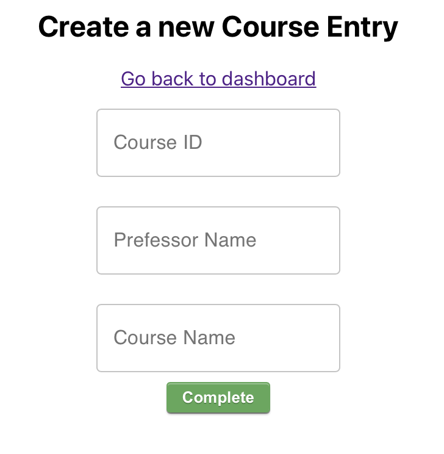
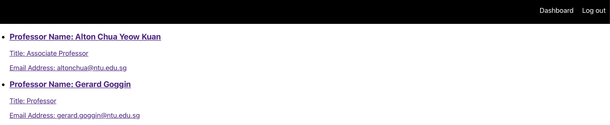
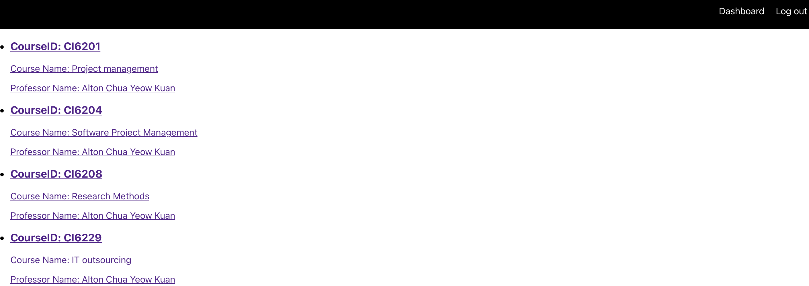
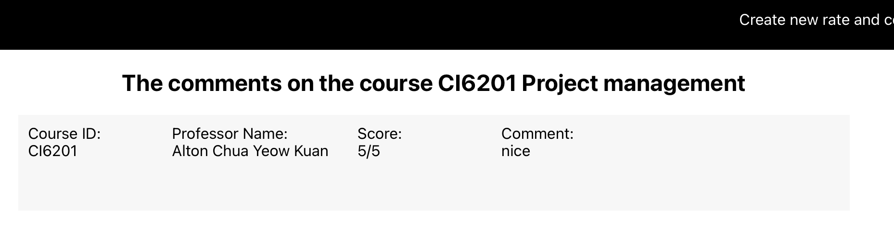
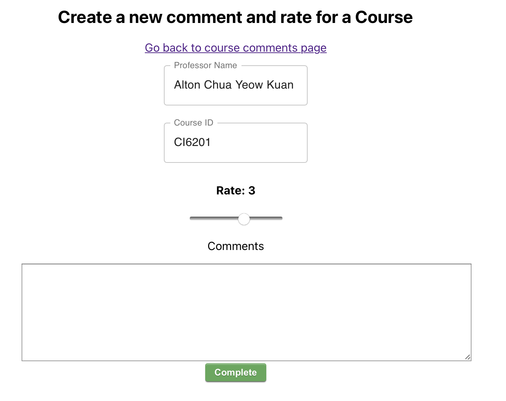
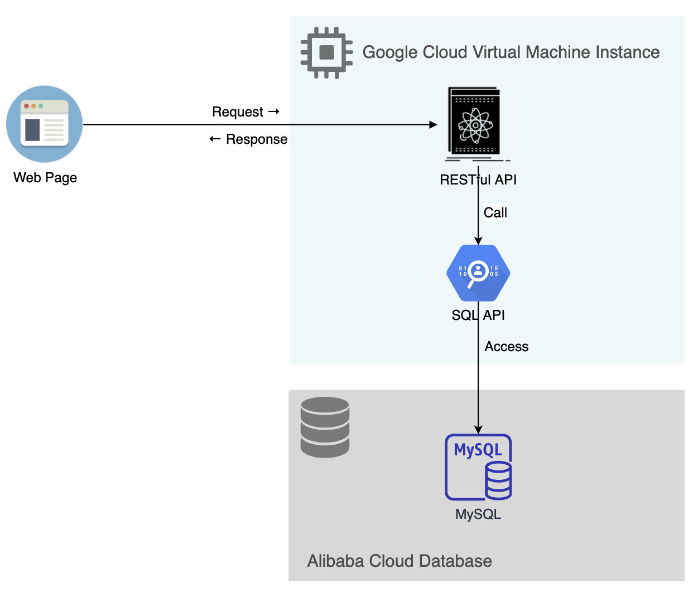
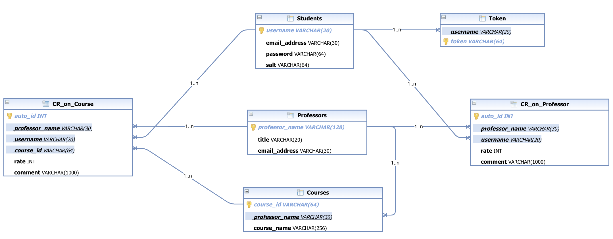
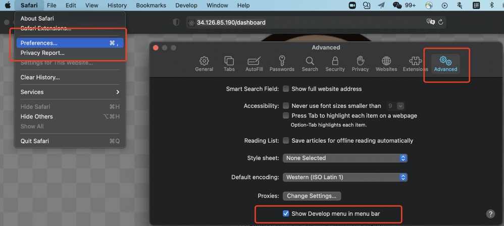
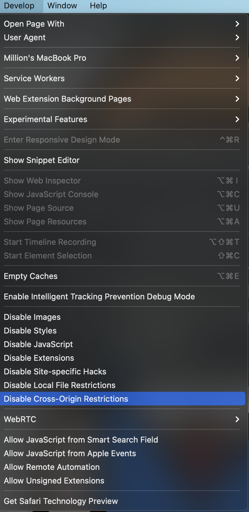

# Development Report of Professor&Course Rating Application


> For better format, please visit the **online page** of this report:


> Our application is deployed to a cloud server and can be visit publicly, please visit: http://34.126.85.190/. Please remember to **disable the cross origin restriction** (a browser's security strategy) of your browser, see the end of [4.3 Deployment & Run in Cloud Server](#43-deployment--run-in-cloud-server) in this report.


- [Development Report of Professor&Course Rating Application](#development-report-of-professorcourse-rating-application)
  - [1. Project Scenario](#1-project-scenario)
  - [2. Architecture Design](#2-architecture-design)
    - [2.1 Entire Architecture](#21-entire-architecture)
    - [2.2 Frontend (React, JavaScript, CSS)](#22-frontend-react-javascript-css)
    - [2.3 Backend (Servlet)](#23-backend-servlet)
  - [3. DataBase Design](#3-database-design)
  - [4. Setup Guide](#4-setup-guide)
    - [4.1 Frontend](#41-frontend)
    - [4.2 Backend](#42-backend)
    - [4.3 Deployment & Run in Cloud Server](#43-deployment--run-in-cloud-server)
  - [5. Description of Roles](#5-description-of-roles)

## 1. Project Scenario

At the beginning of every semester, NTU students need to register courses that they want to take. Usually, the deadline of the course registration is the end of week 2. To decide whether to take a course, students can read the course’s syllabus, and experience the classes in the first two weeks. However, these may be not enough for students to make a good decision. To know about the professor and his/her course more clearly, additional information from those who have taken the course will be helpful.

The Professor & Course Rating System (PCRA) provide a platform where students can publish their comments and rates on a specific professor and his/her course anonymously. Students can also search the professor or the course by name to browse the comments and rates on the professor or the course. All comments and rates are shown anonymously but students can still change or delete their previous comments and rates.

The main users of PCRA are Students and Application Administrator (AA).

Features Completed:

1. Users could register the account through inputting username, password and email address. And they can use existed username and password to sign in.


2. In addition, users could create course entry through inputting course ID, course name and name of the professor whose entry has been created in the database.

3. From dashboard page, users could enter the professors and courses list webpages. All professors' entries and courses' entries are listed in their own page. Users could click each entry to enter that professor or course specific C&R list page.


4. In the specific prof or course page, users could read all comments and score on that professor or course.

5. In some of the webpages, there exist NavBar where users could create their own comments and score for that professor or course, go back to dashboard page and log out through clicking the part of the NavBar.


6. Finally, we restrict the users' accessible webpages. Before login, users only access login, register pages and can't access the other pages via URL. After login, users could access the content pages and can't access login and register via URL.

## 2. Architecture Design

### 2.1 Entire Architecture



The above diagram show our project whole architecture. Our project **does not** integrate the frontend (web page code) into the servlet project. Instead, we divide the frontend and backend clearly, and use RESTful API to connect the frontend and the backend. This mechanism is popular in current internet companies.

We confirm the RESTful API URL in our API document. Then we use servlet to implement the RESTful APIs, strictly based on API document. And we write the API URLs into our frontend project to make the frontend able to use such APIs. Details are introduced below.

**For Security and Authentication**: 
1. We use salted mechanism to protect password.
2. The backend will return a **token** to the frontend when the frontend sends login request. Then the token is added to the header of every request sent by frontend. The backend will check the token's validity each time.

### 2.2 Frontend (React, JavaScript, CSS)

Frontend Codes: [../codes/Frontend](../codes/Frontend) 

1. We choose React as the frontend's framework since it is flexible to achieve the designed UI pattern and features.
2. We choose BrowseRouter to setup the website's route and fetch as the tool to send HTTP requests and receive the responses information.
3. We choose local storage to store the users' login status to restrict their routes' access.
4. Every webpage we use modular design and each page has its own files directory which is clear and easily distinguished.

### 2.3 Backend (Servlet)

The **API document** of our project is [../codes/API_doc.md](../codes/API_doc.md) (which is in Chinese for convenience inside our team). All backend RESTful APIs are developed based on the API document.

Backend Codes [../codes/Backend](../codes/Backend)

To clearly introduce the servlets that we create, we classify these servlets into four groups.

1. Student

   As for student users, the route registration includes student registration and login. Thus, we write two servlets for them respectively. Both `StudentRegisterServlet` and `StudentLoginServlet` are implemented by overwritten the `doPost` method derived from the class `HttpServlet`.

   In `StudentRegisterServlet`, we acquire the username and the password of a new user, and then allocate a token for she/he to attain the authentication to use the functions in the login mode. Before we write the username and the password into the database, the password is encrypted by the MD5 algorithm with a salt value generated from a random UUID, which protects the security of the secret information. After successfully registering a user, `StudentRegisterServlet` sends the response to the client, whose content includes a json `{"info": "Success"}`, otherwise the value of `info` will be `Failed`.

   In `StudentLoginServlet`, the process is similar to that of `StudentRegisterServlet`, but `StudentLoginServlet` only tries to check whether the information sent from the client is correct. If the information matches that in the database, the body of the response includes successful login information.

2. Professor

   In professor part, we register the route `/professor` such that the login user can query the professor list or an indicated professor. 
   
3. Course
   
   Similarly, the route `/course` is in use of querying the course list or an indicated course. Additionally, we implement `CourseCreateServlet` for users to add a course that they would like to comment and rate.
   
4. CourseCR & ProfessorCR

   In these two parts, we implement the create and the query servlets. `CourseCRCreateServlet` and `ProfessorCRCreateServlet` are used for create a comment and a rating for a course or a professor. And the query servlets are for acquire the list of CourseCR and ProfessorCR.

In summary, all the servlets receive or send the json data that can be parsed by the frontend. For inner implementation of the functions, a lower layer called service layer realizes the interactions with the database.

## 3. DataBase Design

As this ER diagram show. Please note that the **foreign key constraint** is specifically shown (field to field) in this diagram.




Data Defined Language script of Database, which can also be found in [](../codes/Database/DDL.sql)

```sql
CREATE DATABASE prof_course_rating_system;

use prof_course_rating_system;

CREATE TABLE Students (
    username VARCHAR(20) NOT NULL, 
    email_address VARCHAR(30) NOT NULL,
    password VARCHAR(64) NOT NULL, 
    salt VARCHAR(64) NOT NULL, 
    PRIMARY KEY (username)
);

CREATE TABLE Token (
    username VARCHAR(20) NOT NULL, 
    token VARCHAR(64) NOT NULL, 
    FOREIGN KEY (username) REFERENCES Students(username), 
    PRIMARY KEY (token)
);

CREATE TABLE Professors (
    professor_name VARCHAR(128) NOT NULL, 
    title VARCHAR(20) NOT NULL, 
    email_address VARCHAR(30) NOT NULL,
    PRIMARY KEY (professor_name)
);

CREATE TABLE Courses (
    course_id VARCHAR(64) NOT NULL, 
    professor_name VARCHAR(30) NOT NULL, 
    course_name VARCHAR(256) NOT NULL,
    PRIMARY KEY (course_id), 
    FOREIGN KEY (professor_name) REFERENCES Professors(professor_name)
);


/* CR's rate range: [1, 5], CR's comment length: <= 1000 words */
CREATE TABLE CR_on_Professor (
    auto_id INT NOT NULL AUTO_INCREMENT, 
    professor_name VARCHAR(30) NOT NULL, 
    username VARCHAR(20) NOT NULL, 
    rate INT NOT NULL, 
    comment VARCHAR(1000), 
    PRIMARY KEY (auto_id), 
    FOREIGN KEY (professor_name) REFERENCES Professors(professor_name), 
    FOREIGN KEY (username) REFERENCES Students(username)
);

CREATE TABLE CR_on_Course (
    auto_id INT NOT NULL AUTO_INCREMENT, 
    professor_name VARCHAR(30) NOT NULL, 
    username VARCHAR(20) NOT NULL, 
    course_id VARCHAR(64) NOT NULL, 
    rate INT NOT NULL, 
    comment VARCHAR(1000), 
    PRIMARY KEY (auto_id), 
    FOREIGN KEY (professor_name) REFERENCES Professors(professor_name), 
    FOREIGN KEY (username) REFERENCES Students(username), 
    FOREIGN KEY (course_id) REFERENCES Courses(course_id)
);
```

## 4. Setup Guide

### 4.1 Frontend

1. If the users want to setup the localhost website, they could use terminal to go into our project's frontend code's directory. Then they could use command npm start to setup and enter the localhost website. 
2. Besides, we use the command npm run build to obtain the frontend's build directory for deploying the website.

### 4.2 Backend
In the IDE IntelliJ IDEA, the configuration of Tomcat is the pictures below:


The build can be done by building artifacts:


Thus, the war file is generated in the target directory.


### 4.3 Deployment & Run in Cloud Server

Open Terminal on Mac, use `ssh` command to login the google cloud server.

```shell
ssh root@34.126.85.190
# Then Enter the Password of root.
```

On server, Use `wget` to download Tomcat 9.0.54 and  decompress the tar file.

```
wget https://dlcdn.apache.org/tomcat/tomcat-9/v9.0.54/bin/apache-tomcat-9.0.54.tar.gz
tar -xzvf apache-tomcat-9.0.54.tar.gz
```

Use `scp` command or use FTP tool such as Filezilla on Mac to upload backend's war file to Tomcat's webapps directory (apache-tomcat-9.0.54/webapps). And rename the war file to "ROOT.war", because Tomcat will automatically set "ROOT.war" as the root web app and users can access such a root web app without enter any suffix after server's IP & port. 

After putting the war file to apache-tomcat-9.0.54/webapps, enter apache-tomcat-9.0.54/bin. Run the script startup.sh to start the Tomcat.

```
bash startup.sh
```

Now, the backend is running. Our project's backend is running at http://34.126.85.190:8080.


Then deploy the frontend project to the server.

Install nginx, npm and node.js on  the server.

```shell
sudo apt install nginx
sudo apt install npm
sudo apt install nodejs
```

Use `scp` command or use FTP tool such as Filezilla on Mac to upload frontend's build folder to server's /var/www/html directory. 

Use `vim` to modify the config of nginx. 

```shell
vim /etc/nginx/sites-enabled/default
```

Here is the nginx config content after modification.

```config
server {
	listen 80 default_server;
	listen [::]:80 default_server;

	root /var/www/html/build;

	index index.html index.htm index.nginx-debian.html;

	server_name _;

	location / {
		try_files $uri $uri/ @router;
	}

    location @router {
        rewrite ^.*$ /index.html last;
    }

    location /api/{
        proxy_pass http://34.126.85.190:8080/;
    }

	
}
```

Then restart nginx service to make the new config work.

```shell
service nginx restart
```

Now our website run at server's 80 port. User can directly enter the URL http://34.126.85.190 to the browser to visit our website.

To normally use the website, user should disable the **cross origin restriction** (a browser's security strategy) of the browser. 

Take Safari as an example. First open Safari-Preferences-Advanced. Enable the "Show Develop menu in menu bar" option. 



Then open develop menu and click "Disable Cross-Origin Restriction".



## 5. Description of Roles

- Chen Haoyu: took charge of Frontend work and UI design. And I also participated in designing the features of the project.
- Lin Jingkun: Backend Engineer. Cloud Server and Cloud Database Applier.
- Wang Mingye: Team Leader, Architect (Design the whole architect), Backend Engineer (Write SQL APIs and RESTful APIs), Database Administrator (Define and create data tables, check the data in database), Site Reliability Engineer (Deploy both frontend project and backend project to the cloud server).