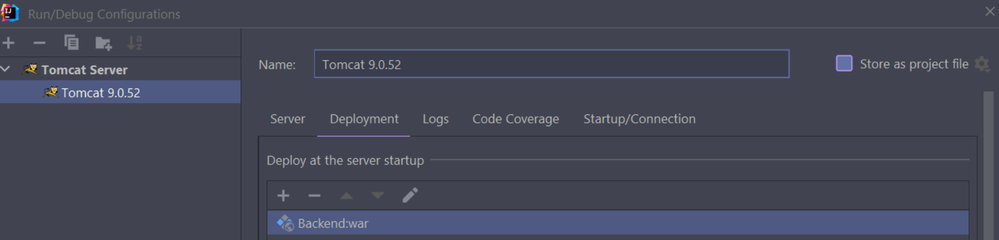

# Development Report of Professor&Course Rating Application


> For better format, please visit the **online page** of this report: [https://ntu-21fall-internet-programming-6206.github.io/Professor-Course-Rating-Applicaion/docs/Report](https://ntu-21fall-internet-programming-6206.github.io/Professor-Course-Rating-Applicaion/docs/Report)


> Our application is deployed to a cloud server and can be visit publicly, please visit: [http://34.126.85.190/](http://34.126.85.190/). Please remember to **disable the cross origin restriction** (a browser's security strategy) of your browser, see the end of [4.3 Deployment & Run in Cloud Server](#43-deployment--run-in-cloud-server) in this report.


- [Development Report of Professor&Course Rating Application](#development-report-of-professorcourse-rating-application)
  - [1. Project Scenario](#1-project-scenario)
  - [2. Architecture Design](#2-architecture-design)
    - [2.1 Entire Architecture](#21-entire-architecture)
    - [2.2 Frontend (React, JavaScript, CSS)](#22-frontend-react-javascript-css)
    - [2.3 Backend (Servlet)](#23-backend-servlet)
    - [2.4 DataBase Design](#24-database-design)
  - [3. Setup Guide](#3-setup-guide)
    - [3.1 Frontend](#31-frontend)
    - [3.2 Backend](#32-backend)
    - [3.3 Deployment & Run in Cloud Server](#33-deployment--run-in-cloud-server)
  - [4. Description of Roles](#4-description-of-roles)

## 1. Project Scenario

At the beginning of every semester, NTU students need to register courses that they want to take. Usually, the deadline of the course registration is the end of week 2. To decide whether to take a course, students can read the course’s syllabus, and experience the classes in the first two weeks. However, these may be not enough for students to make a good decision. To know about the professor and his/her course more clearly, additional information from those who have taken the course will be helpful.

The Professor & Course Rating System (PCRA) provide a platform where students can publish their comments and rates on a specific professor and his/her course anonymously. Students can also search the professor or the course by name to browse the comments and rates on the professor or the course. All comments and rates are shown anonymously.

The main users of PCRA are Students and Application Administrator (AA).

Features Completed:

1. Users could register the account through inputting username, password and email address. And they can use registered username and password to sign in.
2. In addition, users could create course entry by inputting the course ID, course name and name of the professor whose entry has been created in the database.
3. From the dashboard page, users could enter the professors and courses list webpages. All professors' entries and courses' entries are listed on their own page. Users could click each entry to enter that professor or course-specific C&R list page.
4. On the specific professor or course page, users could read all comments and score on that professor or course.
5. In some of the web pages, there exists NavBar where users could create their comments and score for that professor or course, go back to the dashboard page and log out through clicking the part of the NavBar.
6. Finally, we restrict the users' accessible web pages. Before login, users only access login, register pages and can't access the other pages via URL. After login, users could access the content pages and can't access login and register via URL.

## 2. Architecture Design

### 2.1 Entire Architecture


The above diagram show our project whole architecture. Our project **does not** integrate the frontend (web page code) into the servlet project. Instead, we separate the frontend and backend clearly, and use RESTful API to connect the frontend and the backend. This mechanism is popular in current internet companies.

We confirm the RESTful API URL in our API document. Then we use servlet to implement the RESTful APIs, strictly based on API document. And we write the API URLs into our frontend project to make the frontend able to use such APIs. Details are introduced below.

**For Security and Authentication**: 
1. We use salted mechanism to protect password.
2. The backend will return a **token** to the frontend when the frontend sends login request. Then the token is added to the header of every request sent by frontend. The backend will check the token's validity each time.

### 2.2 Frontend (React, JavaScript, CSS)

Frontend Codes: [codes/Frontend](https://github.com/NTU-21Fall-Internet-Programming-6206/Professor-Course-Rating-Applicaion/tree/main/codes/Frontend) in the repository.

1. We choose React as the frontend's framework since it is flexible to achieve the designed UI pattern and features.
2. We choose BrowseRouter to set up the website's route and fetch as the tool to send HTTP requests and receive the responses information.
3. We choose local storage to store the users' login status to restrict their routes' access.
4. Every webpage we use modular design and each page has its own files directory which is clear and easily distinguished.

### 2.3 Backend (Servlet)

The **API document** of our project is [codes/API_doc.md](https://github.com/NTU-21Fall-Internet-Programming-6206/Professor-Course-Rating-Applicaion/blob/main/codes/API_doc.md) (which is in Chinese for convenience inside our team) in the repository. All backend RESTful APIs are developed based on the API document.

Backend Codes [codes/Backend](https://github.com/NTU-21Fall-Internet-Programming-6206/Professor-Course-Rating-Applicaion/tree/main/codes/Backend) in the repository.

Here introduces the servlets that we create:

1. Student
   
   As for student users, the route registration includes student registration and login so there are two servlet classes. 

   `StudentRegisterServlet` acquires the username and the password of a new user, and then allocate a token for she/he to attain the authentication to use the functions in the login mode. Password is protected by salted mechanism.

   `StudentLoginServlet` tries to check whether the information sent from the client is correct. 

2. Professor
   
   In professor part, we register the route `/professor` such that the login user can query the professor list or an indicated professor. 
   
3. Course
   
   Similarly, the route `/course` is in use of querying the course list or an indicated course. Additionally, we implement `CourseCreateServlet` for users to add a course that they would like to comment and rate.
   
4. CourseCR & ProfessorCR

   In these two parts, we implement the create and the query servlets. `CourseCRCreateServlet` and `ProfessorCRCreateServlet` are used for create a comment and a rating for a course or a professor. And the query servlets are for acquire the list of CourseCR and ProfessorCR.

All the servlets receive or send the json data that can be parsed by the frontend. And the servlets call database API to implement the function.

### 2.4 DataBase Design

As this ER diagram show. Please note that the **foreign key constraint** is specifically shown (field to field) in this diagram.


Data Defined Language script of Database, which can also be found in [codes/Database/DDL.sql](https://github.com/NTU-21Fall-Internet-Programming-6206/Professor-Course-Rating-Applicaion/blob/main/codes/Database/DDL.sql)

## 3. Setup Guide

### 3.1 Frontend

1. If the users want to set up the localhost website, they could use terminal to go into our project's frontend code's directory. Then they could use the command npm start to setup and enter the localhost website. 
2. Besides, we use the command npm run build to obtain the frontend's build directory for deploying the website.

### 3.2 Backend
In the IDE IntelliJ IDEA, the configuration of Tomcat is the pictures below:



The build can be done by building artifacts:


Thus, the war file is generated in the target directory.


### 3.3 Deployment & Run in Cloud Server

Open Terminal on Mac, use `ssh` command to login the google cloud server.

```shell
ssh root@34.126.85.190
# Then Enter the Password of root.
```

On server, Use `wget` to download Tomcat 9.0.54 and  decompress the tar file.

```
wget https://dlcdn.apache.org/tomcat/tomcat-9/v9.0.54/bin/apache-tomcat-9.0.54.tar.gz
tar -xzvf apache-tomcat-9.0.54.tar.gz
```

Use `scp` command or use FTP tool such as Filezilla on Mac to upload backend's war file to Tomcat's webapps directory (apache-tomcat-9.0.54/webapps). And rename the war file to "ROOT.war", because Tomcat will automatically set "ROOT.war" as the root web app and users can access such a root web app without enter any suffix after server's IP & port. 

After putting the war file to apache-tomcat-9.0.54/webapps, enter apache-tomcat-9.0.54/bin. Run the script startup.sh to start the Tomcat.

```
bash startup.sh
```

Now, the backend is running. Our project's backend is running at [http://34.126.85.190:8080](http://34.126.85.190:8080).


Then deploy the frontend project to the server.

Install nginx, npm and node.js on  the server.

```shell
sudo apt install nginx
sudo apt install npm
sudo apt install nodejs
```

Use `scp` command or use FTP tool such as Filezilla on Mac to upload frontend's build folder to server's /var/www/html directory. 

Use `vim` to modify the config of nginx. 

```shell
vim /etc/nginx/sites-enabled/default
```

Here is the nginx config content after modification.

```config
server {
	listen 80 default_server;
	listen [::]:80 default_server;
	root /var/www/html/build;
	index index.html index.htm index.nginx-debian.html;
	server_name _;
	location / {
		try_files $uri $uri/ @router;
	}
    location @router {
        rewrite ^.*$ /index.html last;
    }
    location /api/{
        proxy_pass http://34.126.85.190:8080/;
    }	
}
```

Then restart nginx service to make the new config work.

```shell
service nginx restart
```

Now our website run at server's 80 port. User can directly enter the URL [http://34.126.85.190](http://34.126.85.190) to the browser to visit our website.

To normally use the website, user should disable the **cross origin restriction** (a browser's security strategy) of the browser. 

Take Safari as an example. First open Safari-Preferences-Advanced. Enable the "Show Develop menu in menu bar" option. 


Then open develop menu and click "Disable Cross-Origin Restriction".


## 4. Description of Roles

- Chen Haoyu: Frontend Engineer, UI/UX designer.
- Lin Jingkun: Backend Engineer. Cloud Server and Cloud Database Applier.
- Wang Mingye: Team Leader, Architect (Design the whole architect), Backend Engineer (Write SQL APIs and RESTful APIs), Database Administrator (Define and create data tables, check the data in database), Site Reliability Engineer (Deploy both frontend project and backend project to the cloud server).